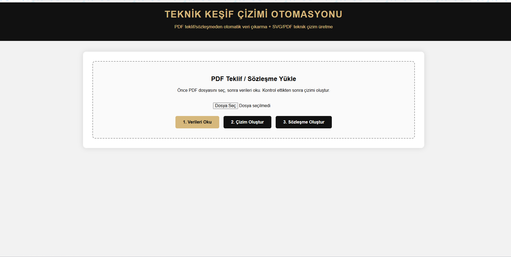
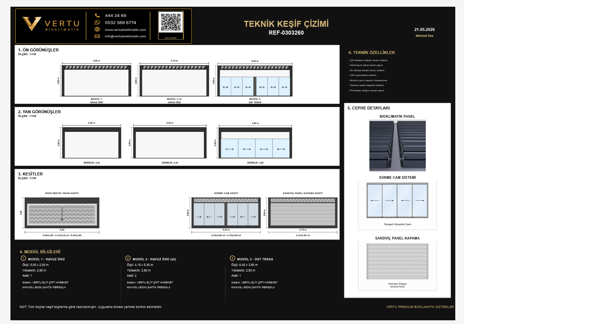
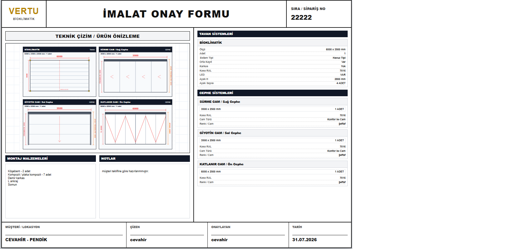

# Technical Production Automation

PHP tabanlı teknik çizim, sözleşme oluşturma ve imalat onay süreçlerini tek bir web panelinde birleştiren üretim otomasyon sistemidir.

Proje; teklif ve proje bilgilerinin daha hızlı işlenmesini, teknik belgelerin standart şekilde hazırlanmasını ve tekrar eden işlemlerin azaltılmasını amaçlamaktadır.

---

## Uygulama Görselleri

### Ana Panel

Ana panel üzerinden teknik çizim ve imalat onay modüllerine erişilebilir.


---

### Teknik Çizim ve Sözleşme Modülü

PDF teklif veya sözleşme dosyaları yüklenerek müşteri, ürün, ölçü ve proje bilgileri otomatik şekilde işlenebilir.



---

### Teknik Çizim Örneği

Girilen veya PDF dosyasından alınan proje bilgilerine göre ölçülendirilmiş teknik çizimler oluşturulur.



---

### İmalat Onay Formu

Ürün ve ölçü bilgileri kullanılarak üretime uygun imalat onay formu hazırlanır ve PDF çıktısı oluşturulur.



---

## Modüller

### 1. Teknik Çizim ve Sözleşme Modülü

Teknik modül, teklif ve sözleşme belgelerindeki bilgileri okuyarak teknik çıktılara dönüştürür.

#### Özellikler

- PDF teklif ve sözleşme dosyası yükleme
- PDF içerisindeki proje bilgilerinin okunması
- Müşteri bilgilerinin otomatik ayrıştırılması
- Ürün, modül ve ölçü bilgilerinin tespit edilmesi
- SVG tabanlı teknik çizim oluşturma
- Teknik çizimi PDF olarak dışa aktarma
- Sözleşme belgesini PDF olarak oluşturma
- Sözleşme belgesini Word formatında oluşturma
- Ürün kataloğu üzerinden sistem detaylarını eşleştirme
- Cephe ve ürün detay görsellerini kullanma

### 2. İmalat Onay Formu Modülü

İmalat modülü, üretime gönderilecek proje bilgilerinin düzenlenmesini ve onay formunun hazırlanmasını sağlar.

#### Özellikler

- Müşteri ve proje bilgilerini girme
- Ürün ölçülerini tanımlama
- Otomatik teknik görünüş oluşturma
- Manuel teknik çizim hazırlama
- Düzenlenebilir CAD çalışma alanı
- Otomatik çizimi CAD alanına aktarma
- Teknik açıklama ve not ekleme
- İmalat onay formu oluşturma
- Formu PDF olarak dışa aktarma

---

## Kullanılan Teknolojiler

- PHP
- HTML5
- CSS3
- JavaScript
- SVG
- Composer
- Dompdf
- PHPWord
- PDF Parser
- PHP GD Extension

---

## Proje Yapısı

```text
technical-production-automation/
│
├── assets/
│   ├── bg.jpg
│   ├── teknik.jpg
│   └── imalat.jpg
│
├── teknik/
│   ├── assets/
│   ├── includes/
│   ├── generate_contract_docx.php
│   ├── generate_contract_pdf.php
│   ├── generate_drawing.php
│   ├── generate_drawing_pdf.php
│   ├── parse_pdf.php
│   ├── upload.php
│   ├── composer.json
│   └── index.php
│
├── imalat/
│   ├── assets/
│   ├── includes/
│   ├── analyze_image.php
│   ├── generate_drawing.php
│   ├── generate_pdf.php
│   └── index.php
│
├── ana-panel.png
├── teknik_cizim_panel.png
├── teknik_cizim.png
├── imalat_onayform_örnek.png
├── .gitignore
├── README.md
└── index.php
