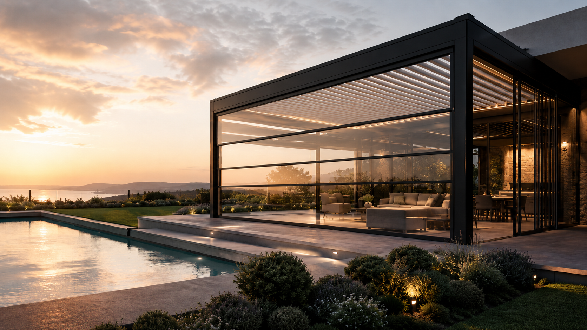
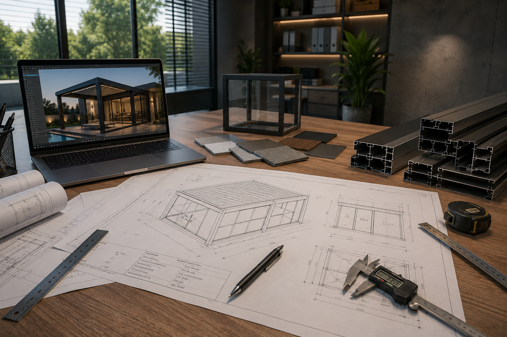
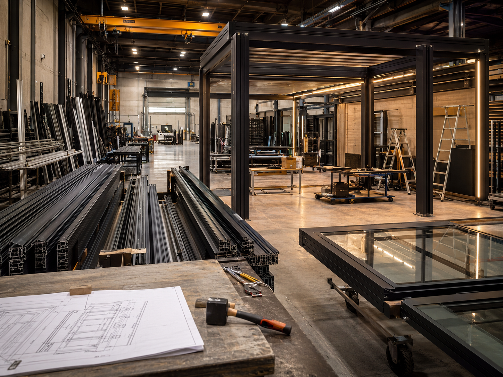

# technical-production-automation
A PHP-based web automation system that combines technical drawing generation, contract creation, and manufacturing approval workflows in a single dashboard.
# Technical Production Automation

PHP tabanlı teknik çizim, sözleşme oluşturma ve imalat onay süreçlerini tek bir web panelinde birleştiren otomasyon sistemi.

Bu proje, teklif ve proje bilgilerinin işlenmesini kolaylaştırmak, tekrarlanan işlemleri azaltmak ve teknik belgelerin daha hızlı hazırlanmasını sağlamak amacıyla geliştirilmiştir.

---

## Ana Panel



Sistem iki temel modülden oluşmaktadır:

- Teknik Çizim ve Sözleşme Modülü
- İmalat Onay Formu Modülü

---

## Teknik Çizim ve Sözleşme Modülü



Teknik modül, teklif ve sözleşme belgelerindeki bilgilerin işlenerek teknik çıktılara dönüştürülmesini sağlar.

### Özellikler

- PDF teklif ve sözleşme dosyası yükleme
- PDF içerisindeki proje bilgilerinin okunması
- Müşteri ve proje bilgilerinin otomatik ayrıştırılması
- Modül, ölçü ve ürün bilgilerinin tespit edilmesi
- SVG tabanlı teknik çizim oluşturma
- Teknik çizimi PDF olarak dışa aktarma
- Sözleşme belgesini PDF olarak oluşturma
- Sözleşme belgesini Word formatında oluşturma
- Ürün kataloğu üzerinden sistem detaylarının eşleştirilmesi
- Cephe ve ürün detay görsellerinin kullanılması

---

## İmalat Onay Formu Modülü



İmalat modülü, üretime gönderilecek proje bilgilerinin düzenlenmesini ve imalat onay formunun hazırlanmasını sağlar.

### Özellikler

- Müşteri ve proje bilgilerinin girilmesi
- Ürün ölçülerinin tanımlanması
- Manuel teknik çizim oluşturma
- Görsel destekli çizim hazırlama
- Düzenlenebilir CAD çalışma alanı
- Otomatik oluşturulan çizimi CAD alanına aktarma
- İmalat onay formu oluşturma
- Formu PDF formatında dışa aktarma
- Teknik not ve açıklama alanları
- Projeye özel ölçülendirme

---

## Proje Görselleri

Ana portalın gerçek çalışma ekran görüntüsünü repoya `proje-ekrani.png` adıyla yükledikten sonra aşağıdaki alan otomatik olarak görünecektir.


---

## Kullanılan Teknolojiler

- PHP
- HTML5
- CSS3
- JavaScript
- SVG
- Composer
- PDF Parser
- Dompdf
- PHPWord
- GD Extension

---

## Proje Yapısı

```text
technical-production-automation/
│
├── assets/
│   ├── bg.jpg
│   ├── teknik.jpg
│   └── imalat.jpg
│
├── teknik/
│   ├── assets/
│   ├── includes/
│   ├── generate_contract_docx.php
│   ├── generate_contract_pdf.php
│   ├── generate_drawing.php
│   ├── generate_drawing_pdf.php
│   ├── parse_pdf.php
│   ├── upload.php
│   ├── composer.json
│   └── index.php
│
├── imalat/
│   ├── assets/
│   ├── includes/
│   ├── analyze_image.php
│   ├── generate_drawing.php
│   ├── generate_pdf.php
│   └── index.php
│
├── .gitignore
└── index.php
